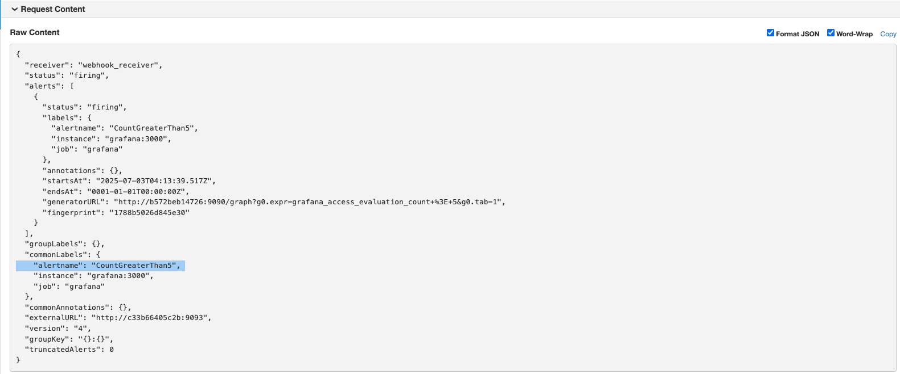

# prometheus-grafana-monitoring
Repo to set up simple prometheus and grafana instances.

### Steps:

1. Clone the repo.
2. cd to repo.
3. run `docker-compose up -d`
4. Prometheus and Grafana instances are up and running.
5. Access the Prometheus instance at [http://localhost:9090](http://localhost:9090)
6. Access the Grafana instance at [http://localhost:3000](http://localhost:3000)
7. Access the Alert Manager at [http://localhost:9093](http://localhost:9093)
8. Enter the username as 'admin' and password as 'grafana' to log in to grafana instance.
9. Prometheus is added a datasource and it's metrics are available in the grafana instance.
10. To verify the alerts, Go to [Alert Manager](http://127.0.0.1:9093/#/alerts) or [rules section](http://localhost:3000/alerting/list) in Grafana and check the alert status.
11. You can also check the webhook receiver (if any) for alert details. Refer the screenshot below for more details.'

